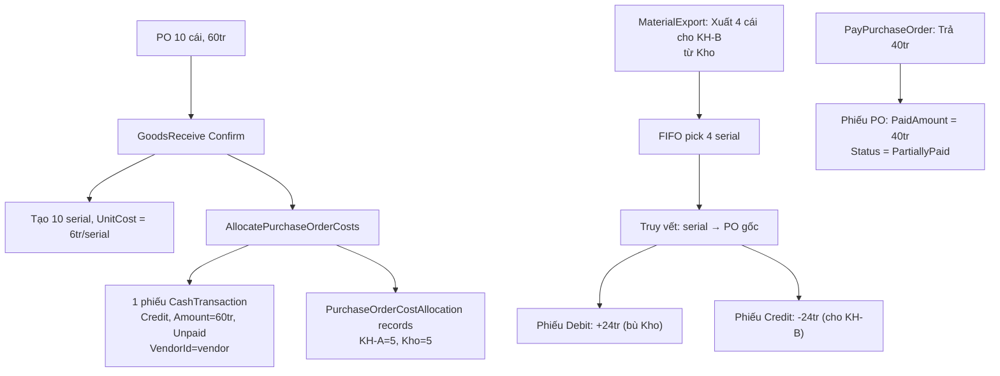

# Tổng hợp Yêu cầu & Logic nghiệp vụ

Tài liệu này tổng hợp **toàn bộ yêu cầu và quyết định logic** của bác từ phiên grill-me (26 câu hỏi) và quá trình thực hiện.

---

## 1. MaterialExport — Tách hoàn toàn khỏi PurchaseOrder

### Yêu cầu gốc
> *"Tách MaterialExport hoàn toàn khỏi PO, viết lại pipeline trừ kho + serial mới."*

### Quyết định
| Trước | Sau |
|-------|-----|
| MaterialExport gắn `PurchaseOrderId` → phải chọn PO trước | MaterialExport gắn `WarehouseId` → chọn **Kho** trước |
| Sản phẩm load từ PO items | Sản phẩm load từ **tồn kho thực tế** trong warehouse |
| Trừ kho qua `AllocatePurchaseOrderCosts` | Trừ kho **trực tiếp** bởi MaterialExport |

### Logic frontend
> *"Gỡ bỏ hoàn toàn dropdown PO... nhưng chỉ hiện những hàng nào còn tồn thôi... nếu chọn vượt quá số lượng tồn thì lại ngu."*
> 
> *"Cần chọn Kho (Warehouse) trước, rồi chỉ hiển sản phẩm/serial tồn trong kho đó."*

- Dropdown **Kho** bắt buộc chọn trước
- Sản phẩm chỉ hiện những cái **còn tồn** (InStock) trong kho đã chọn
- Validate: `quantity <= stockQuantity`, chặn nếu vượt

---

## 2. Serial Picking — FIFO + Manual

### Yêu cầu
> *"Ở item khi chỉ nhập số lượng thôi thì pick theo FIFO, còn khi chọn device serial thì là bằng tay."*
> 
> *"Lấy giá nhập từ chính những serial được bốc ra (trật tự nhất nhưng cần mỗi serial lưu giá)."*

### Logic
1. **Mặc định FIFO**: Khi user chỉ nhập số lượng, backend tự bốc serial cũ nhất trước (`ORDER BY CreatedAtUtc ASC`)
2. **Manual override**: Nếu user mở Serial Picker chọn serial cụ thể → dùng serial đó thay FIFO
3. **Giá xuất**: Tính từ `UnitCost` của từng serial được bốc ra

---

## 3. UnitCost — Giá nhập per serial

### Yêu cầu
> *"Thêm UnitCost (double?) vào ProductSerial, gán giá tại thời điểm nhập kho (GoodsReceive/PO confirm)."*

### Logic
```
UnitCost = PurchaseOrderItem.AfterTaxAmount / PurchaseOrderItem.Quantity
```
- Gán lúc tạo serial trong `SyncPurchaseOrderItemSerialsAsync`
- Mỗi serial lưu giá nhập riêng → khi xuất kho, tính tổng `Sum(serial.UnitCost)` cho đúng giá vốn

---

## 4. CashTransaction — Debit/Credit đối ứng (thay Wipe & Rebuild)

### Yêu cầu gốc (ban đầu muốn Wipe)
> *"Không giữ PurchaseOrderId. Khi xuất kho, hệ thống tự tra serial → tìm PurchaseOrderItemId → tìm PurchaseOrderId → wipe phiếu Kho."*
> *"Chỉ Wipe phiếu 'Kho' của PO gốc, không đụng đến phiếu khách hàng khác."*

### Thay đổi sang Debit/Credit (quyết định sau)
> *"Thay vào đó khi xuất kho vật tư mày tạo mé thêm phiếu trừ kho ví dụ như xuất 4 cái cho khách B thì nó dựa vào giá trước đó -4 rồi +4 cho khách B như vậy phải dễ hơn không? mà không cần wipe rebuild lại nữa mà có thể xem đơn trước."*

> *"Phiếu giảm Kho: **Debit (thu vào)** — vì nó bù trừ 1 phiếu Credit trước đó."*

### Logic khi MaterialExport Confirm
Truy vết PO qua serial chain: `serial.PurchaseOrderItemId → PurchaseOrderItem.PurchaseOrderId`

Tạo **2 phiếu đối ứng** per PO gốc:

| Phiếu | TransactionType | Amount | CustomerId | VendorId | CashAccountId | Status | SourceModule |
|-------|----------------|--------|------------|----------|---------------|--------|--------------|
| Bù trừ Kho | **Debit** | totalCost | `null` | `null` | `null` | Paid | MaterialExport |
| Chi cho Khách | **Credit** | totalCost | `entity.CustomerId` | `null` | `null` | Paid | MaterialExport |

> **Kết quả**: Không wipe phiếu cũ, chỉ tạo thêm → giữ nguyên lịch sử. Tổng vẫn cân bằng.

---

## 5. AllocatePurchaseOrderCosts — 1 phiếu CashTransaction duy nhất per PO

### Yêu cầu
> *"Hiện tại khi PO chia đơn nó sẽ tạo **1 phiếu giao dịch thu chi** nhưng khi nhấn vào cái phiếu đó thì sẽ hiện các box cũ nhưng sẽ thêm mục chi tiết nữa như mục item chi tiết chia đơn nào ra và bấm vào thanh toán thì nó sẽ thanh toán cho phiếu này."*

### Logic (trước → sau)
| Trước (sai) | Sau (đúng) |
|------------|-----------|
| Tạo **N phiếu** (1/khách + 1/kho), mỗi phiếu `Status = Paid` | Tạo **1 phiếu duy nhất** cho toàn bộ PO |
| `CashAccountId` = account thật → trừ số dư | `CashAccountId = null` → **không trừ tiền thật** |
| Mỗi phiếu có `CustomerId` riêng | `CustomerId = null` (phiếu chung) |
| `VendorId = null` | `VendorId = PO.VendorId` ← **quan trọng cho công nợ** |
| `Status = Paid` (SAI!) | `Status = Unpaid` (chưa thanh toán) |

> *"Sao sau khi chia đơn status mà lại = paid? Phải trả đủ tiền mới paid chứ, còn thiếu tiền thì là nợ chứ."*

### Chi tiết chia đơn
- `PurchaseOrderCostAllocation` records vẫn tạo bình thường (lưu ai nhận bao nhiêu)
- Khi click vào phiếu → hiện **bảng chi tiết readonly**: Sản phẩm | Khách hàng | Số lượng | Đơn giá | Thành tiền
- **Không cho sửa trên phiếu** → muốn sửa phải về PO chia lại (wipe & rebuild)

---

## 6. PayPurchaseOrder — Flow thanh toán

### Yêu cầu
> *"Nút thanh toán trên PO là để thanh toán cho vendor... khi tạo phiếu thanh toán mới để trả thì nó sẽ xem xét cái phiếu đó trả đủ phần đó không."*

> *"Đơn PO 100tr tôi trả 90tr thì nó chia tiền đều cho khách trước, kho sau — nhưng bây giờ khi chia đơn tạo phiếu thì người dùng chỉ được thanh toán trên PO, còn ở cash transaction không được thanh toán nợ."*

### Logic
1. Tìm **1 phiếu CashTransaction duy nhất** (`SourceModule = "PurchaseOrder" AND SourceModuleId = PO.Id`)
2. Cập nhật `PaidAmount += paymentAmount`
3. Tính Status:
   - `PaidAmount >= Amount` → **Paid**
   - `PaidAmount > 0` → **PartiallyPaid**  
   - `PaidAmount == 0` → **Unpaid**
4. Gọi `RecalculateAccountBalance` cho account được chọn

---

## 7. VendorDebtReport — Công thức công nợ

### Yêu cầu
> *"Công nợ = **Tổng PO Confirmed - Tổng PaidAmount của các phiếu thu chi có VendorId** (bao gồm cả phiếu PO lẫn phiếu tạo tay)."*

> *"Hiện tại vendordebtreport có nghĩa là công nợ từ PO hoặc giao dịch thu chi mà mình tự tạo 10tr nhưng thanh toán có 5tr thì vẫn là công nợ."*

### Công thức

```
Công nợ Vendor = TotalPurchase - TotalPaid
```

Trong đó:
- `TotalPurchase = SUM(PO.AfterTaxAmount)` WHERE `Status = Confirmed` AND `VendorId = X`
- `TotalPaid = SUM(CashTransaction.PaidAmount)` WHERE `VendorId = X` AND `IsDeleted = false`

### Điểm quan trọng
- Chỉ dùng **`PaidAmount`**, KHÔNG dùng `Amount` (Amount là tổng nợ)
- Phiếu MaterialExport có `VendorId = null` → **tự động bị loại** khỏi công nợ Vendor ✅
- Phiếu tạo tay (kế toán tự tạo trong Thu Chi) nếu có `VendorId` → tính vào

---

## 8. Serial Tracking — Quy tắc bắt buộc

### Yêu cầu
> *"Giữ như hiện tại - tất cả sản phẩm physical bắt buộc serial-tracked (InternalAuto hoặc ManufacturerSerial)."*

- `SerialTrackingMode` có 3 giá trị: `None = 0`, `InternalAuto = 1`, `ManufacturerSerial = 2`
- **Tất cả** sản phẩm physical đều phải là serial-tracked
- Không có mode "không serial" cho hàng physical

---

## 9. Kế toán tạo phiếu Chi thủ công

### Yêu cầu
> *"Giữ như Plan - kế toán tạo thủ công phiếu Chi trong màn hình Thu Chi, không cần code gì thêm."*

- Khi cần chi tiền thật cho khách (Khách B mua 4 cái): kế toán **tự tạo** phiếu Chi trên CashTransaction UI
- Không cần tự động hóa phần này

---

## 10. Tổng kết Flow end-to-end

### Ví dụ: PO 10 cái, 60tr



### Kiểm chứng số liệu
| Mục | Giá trị |
|-----|---------|
| PO Amount | 60tr |
| Phiếu PO (Credit) | Amount = 60tr, PaidAmount = 40tr |
| Phiếu ME Debit (bù Kho) | +24tr |
| Phiếu ME Credit (KH-B) | -24tr |
| **Tổng net CashTransaction** | 60tr - 24tr + 24tr = **60tr** ✅ |
| **Công nợ Vendor** | 60tr - 40tr = **20tr** ✅ |
| **Tồn kho** | 10 - 4 = **6 serial** (5 KH-A + 1 Kho) ✅ |
